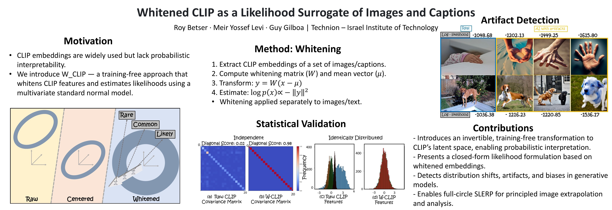

# Whitened CLIP as a Likelihood Surrogate of Images and Captions

[](https://arxiv.org/abs/2505.06934)
[](https://creativecommons.org/licenses/by/4.0/)
[](https://www.python.org/)

> **Official repository** for the paper:  
> 📄 **W_CLIP: Whitening-Enhanced Likelihood for Image-Text Embedding Alignment**  
> Accepted to the **42nd International Conference on Machine Learning (ICML 2025)**
> [[arXiv:2505.06934](https://arxiv.org/abs/2505.06934)]

---

## 🧠 Overview

**W_CLIP** introduces a **training-free** method to estimate the likelihood of images and captions using CLIP embeddings.  
By applying a **whitening transformation** to the CLIP latent space, the method standardizes embeddings to have zero mean, unit variance, and no inter-feature correlation.  
This transformation results in an identity covariance matrix, allowing each embedding to approximate a multivariate standard normal distribution.  
Consequently, the log-likelihood of a sample can be directly estimated from the squared Euclidean norm of its whitened embedding — enabling efficient and direct likelihood scoring for both images and texts.

### 🔑 Key Contributions

- **Whitened CLIP (W_CLIP):**  
  An invertible linear transformation applied to CLIP embeddings, yielding whitened features with zero mean and identity covariance.

- **Statistical Validation:**  
  Empirically validated the Gaussianity of whitened embeddings using statistical tests (Anderson-Darling, D’Agostino-Pearson), supporting their suitability for likelihood estimation.

- **Direct Likelihood Estimation:**  
  Enables closed-form computation of likelihoods from the norm of whitened features, offering a principled alternative to black-box scoring methods.

- **Experiments:**  
  Demonstrated effectiveness on multiple tasks:
  - Detecting artifacts in generated images.
  - Assessing distribution shifts (e.g., ImageNet-C/R).
  - Enabaling full-circle SLERP for image interpolation.

<p align="center">
  
</p>

---
## 📓 Colab Notebooks

You can explore the core functionality of W_CLIP directly in your browser via Google Colab:

| Notebook | Description | Link |
|----------|-------------|------|
| `calc_log_like_image_demo.ipynb` | Computes log-likelihood for given images | [](https://colab.research.google.com/github/rbetser/W_CLIP/blob/main/calc_log_like_image_demo.ipynb) |
| `calc_log_like_text_demo.ipynb` | Computes log-likelihood of text prompts | [](https://colab.research.google.com/github/rbetser/W_CLIP/blob/main/calc_log_like_text_demo.ipynb) |

---

## 📦 Installation

Clone the repo and install dependencies:

```bash
git clone https://github.com/rbetser/W_CLIP.git
cd W_CLIP
```

## 🧩 Requirements

This project requires the following packages:

- [PyTorch](https://pytorch.org/) (with GPU support recommended)
- [OpenAI CLIP](https://github.com/openai/CLIP)
- [🤗 Transformers](https://github.com/huggingface/transformers)
- [🤗 Diffusers](https://github.com/huggingface/diffusers)

Install with:

```bash
pip install git+https://github.com/openai/CLIP.git
pip install transformers diffusers
```

> 💡 **Note:** The `transformers` and `diffusers` libraries are needed only for the full-circle SLERP functionality.

> 💡 **Note:** The full-circle SLERP functionality uses the **UnCLIP framework** via `diffusers.pipelines.unclip.UnCLIPImageVariationPipeline` from Hugging Face.
---

## 🚀 Usage

This reposirtory provides scripts to compute log-likelihoods for images and texts using CLIP embeddings, compute whitening matrices, and perform full-circle SLERP using the UnCLIP framework.

### 1. Compute Log-Likelihood for Images

```bash
python calc_log_like_image_demo.py
```

### 2. Compute Log-Likelihood for Text

```bash
python calc_log_like_text_demo.py
```

> ⚠️ **Note:** Image paths, text prompts, and model configurations are currently hardcoded in the demo scripts. Modify the scripts directly to change inputs.  
> ✅ Precomputed whitening matrices and mean vectors are available in the `w_mats/` folder and are required for log-likelihood computations.

### 3. Compute Whitening Matrix using a Set of Images or Text Captions

```bash
python whitening_code.py
```

This script computes a whitening matrix (`w_mat`) and mean vector (`mu`) from a set of CLIP embeddings extracted from either images or text prompts.  
Both outputs are saved to the `w_mats/` directory and are required for likelihood estimation.

> ⚠️ The input data (images or texts) used for computing whitening is currently defined in the script and should be edited manually.

### 4. Full-Circle SLERP with UnCLIP

```bash
python circle_slerp.py
```

> 💡 **Note:** The full-circle SLERP functionality uses the `UnCLIPImageVariationPipeline` from 🤗 Hugging Face's `diffusers` library. Ensure that both `diffusers` and `transformers` are installed.

---

## 📁 Repository Structure

```
W_CLIP/
├── images_dogs/                 # Sample dog images for testing
├── images_hands/                # Sample hand images for testing
├── w_mats/                      # Precomputed whitening matrices
├── calc_log_like_image_demo.py # Script to compute image log-likelihood
├── calc_log_like_text_demo.py  # Script to compute text log-likelihood
├── circle_slerp.py             # Full-circle SLERP using UnCLIP
├── whitening_code.py           # Whitening matrix computation
└── README.md                   # Project documentation
```

Each script is self-contained and can be run independently.

---

## 📚 Citation

If you use this code or find it helpful, please cite:

```bibtex
@inproceedings{betser2025whitened,
  title={Whitened CLIP as a Likelihood Surrogate of Images and Captions},
  author={Betser, Roy and Levi, Meir Yossef and Gilboa, Guy},
  booktitle={Proceedings of the 42nd International Conference on Machine Learning (ICML)},
  year={2025},
  note={To appear},
  archivePrefix={arXiv},
  eprint={2505.06934}
}
```

---
## 🎥 Presentation Video

📽️ [Watch the 5-minute video presentation on YouTube]([https://youtu.be/FIcgHjKhxfI])


---

## 🙋 Contact

For questions, feedback, or collaborations:

- 📧 [Roy Betser](mailto:roybe@campus.technion.ac.il)
- 🐛 Open an issue on [GitHub](https://github.com/rbetser/W_CLIP/issues)
